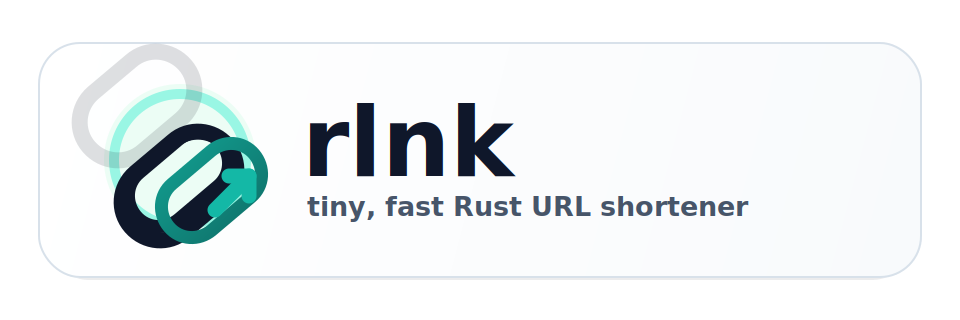

# rlnk

<p align="center">
  
</p>

MongoDB backed URL shortener written in Rust.

## Requirements

- Rust 1.90+
- MongoDB 8+ for local development, or Docker / Docker Compose

## Environment

The application reads the following environment variables:

- `MONGO_URI`: MongoDB connection string
- `APP_KEY`: shared secret used by `POST /gen`, `DELETE /{hash}`, and `GET /stat`
- `APP_HOSTNAME`: base URL used to build returned short URLs
- `APP_BIND_ADDR`: optional bind address, defaults to `0.0.0.0:8080`
- `MONGO_DATABASE`: optional database name, defaults to `rlnk`
- `MONGO_COLLECTION`: optional collection name, defaults to `links`
- `HASH_LENGTH`: optional generated hash length, defaults to `8`

## Local run

Start MongoDB locally and export environment variables:

```sh
export MONGO_URI='mongodb://localhost:27017'
export APP_KEY='dev-secret'
export APP_HOSTNAME='http://localhost:8080'
cargo run
```

## Docker Compose

Create a local `.env` file from `.env.sample`, then start the stack:

```sh
cp .env.sample .env
docker compose up --build
```

## API

Create a short URL:

```sh
curl -X POST http://localhost:8080/gen \
  -H 'Authorization: dev-secret' \
  -H 'Content-Type: application/json' \
  -d '{"url":"https://example.com","ttl":"10m"}'
```

Delete a short URL:

```sh
curl -X DELETE http://localhost:8080/abc123 \
  -H 'Authorization: dev-secret'
```

Fetch statistics:

```sh
curl http://localhost:8080/stat \
  -H 'Authorization: dev-secret'
```

Resolve a short URL:

```sh
curl -i http://localhost:8080/abc123
```
